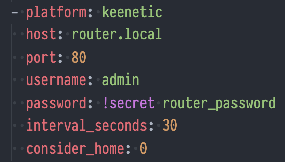
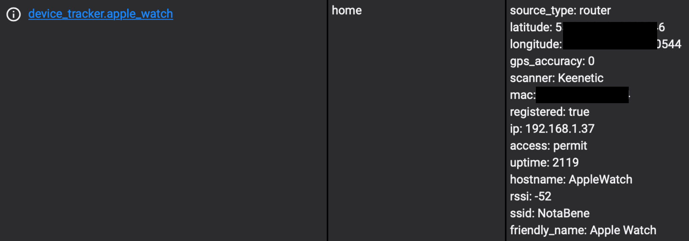
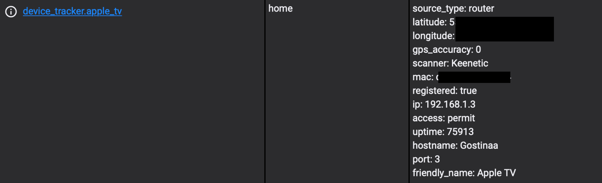

# Keenetic `device_tracker`
## Home Assistant [device_tracker](https://www.home-assistant.io/integrations/device_tracker/) component for Keenetic routers

Copy whole `keenetic` folder to your `custom_components` or install using [HACS](https://hacs.xyz).

Configuration:

inside of `device_tracker.yaml` file or `device_tracker` section.

Wireless clients with `ssid` and `rssi` data:

Wired clients with `port` data:
